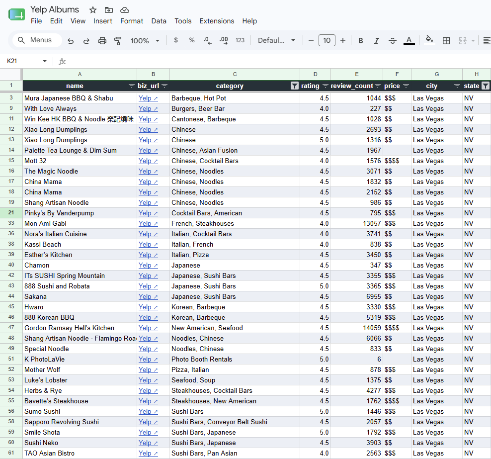

# Yelp Album Tracker

Scrapes all businesses from a public Yelp album (collection) and writes them to a Google Sheet. A small FastAPI web app lets you add albums through a browser form.



## How it works

```
POST /scrape  →  Playwright (scroll to load all)
              →  BeautifulSoup (extract fields)
              →  gspread (upsert to Google Sheet)

APScheduler   →  runs every tracked album daily at SCHEDULE_TIME
```

Fields written per business: `name`, `biz_url`, `category`, `rating`, `review_count`, `price`, `neighborhood`, `first_seen`, `last_seen`.

---

## Prerequisites

- [Miniforge / conda](https://github.com/conda-forge/miniforge) (or any conda distribution)
- A Google account with access to Google Sheets
- A Google Cloud project (free tier is fine)

---

## 1 — Google Cloud setup

### 1a. Enable the Google Sheets API

1. Go to [console.cloud.google.com](https://console.cloud.google.com) and create a project (or pick an existing one).
2. Click **APIs & Services → Library**.
3. Search for **Google Sheets API** and click **Enable**.

### 1b. Create a service account (free)

1. **APIs & Services → Credentials → Create Credentials → Service account**.
2. Give it any name (e.g. `yelp-tracker`), click **Done**.
3. Click the new service account → **Keys → Add Key → Create new key → JSON**.
4. Save the downloaded file to `credentials/service-account.json` inside this repo.
   ```
   yelp-tracker/
   └── credentials/
       └── service-account.json   ← here
   ```
   This path is in `.gitignore` and will never be committed.

### 1c. Create a Google Sheet and share it

1. Create a new Google Sheet (using your personal email or any other email besides the service account).
2. Copy the **Sheet ID** from its URL:
   ```
   https://docs.google.com/spreadsheets/d/SHEET_ID_IS_HERE/edit
   ```
3. Open the service-account JSON and copy the `client_email` value (looks like `name@project.iam.gserviceaccount.com`).
4. In the Google Sheet, click **Share** and add that email as an **Editor**.

---

## 2 — Create a conda environment

```bash
conda create -n yelp_tracker python=3.11
conda activate yelp_tracker
pip install -r requirements.txt
playwright install chromium
```

The `playwright install chromium` step downloads the Chromium binary (~110 MB) and only needs to run once per machine.

---

## 3 — Configure .env

Copy the example file and fill in your values:

```bash
cp .env.example .env
```

```ini
# Path to the service account JSON (relative to project root)
GOOGLE_CREDENTIALS_PATH=credentials/service-account.json

# The ID from your Google Sheet URL
GOOGLE_SHEET_ID=your_sheet_id_here

# Tab name inside the sheet
GOOGLE_WORKSHEET_NAME=Sheet1

# Daily run time (24-hour, local time)
SCHEDULE_TIME=03:00
```

---

## 4 — Run locally with the following commandws 

```bash
conda activate yelp_tracker (name of your conda env)
uvicorn app.main:app --reload
```

Open [http://localhost:8000](http://localhost:8000) in your browser.

Paste a Yelp album URL into the form and click **Scrape & sync**. A Chromium window will open, scroll through the album, then close. Results land in your Google Sheet within a minute or two depending on how many businesses the album has.


---

## Things to Know

- Multiple albums can be uploaded, one at a time
- The Google Sheet will retain its information regardless of whether the application is open
- If you would like to repopulate the sheet, erase the contents and re-upload album links
- The header column will persist with each link upload and file erasure 
- Duplicate businesses will be ignored

## Google Sheet Contents

**name** - Business name
**biz_url** - Business Yelp Link
**category** - Business 
**rating** - Average star rating (rounded to nearest 0.5 interval)
**review_count** - Number of business reviews
**price** - Dollar signs indicating expense rating $$
**city** - City of business
**state** - State of business 


## Project layout

```
yelp-album-tracker/
├── app/
│   ├── __init__.py
│   ├── config.py          # loads .env
│   ├── main.py            # FastAPI routes + lifespan
│   ├── parser.py          # HTML → list of dicts
│   ├── pipeline.py        # scraper → parser → sheets
│   ├── scheduler.py       # APScheduler daily job
│   ├── scraper.py         # Playwright: URL → HTML
│   ├── sheets.py          # dicts → Google Sheet (upsert)
│   ├── storage.py         # tracked-album URLs (JSON file)
│   └── templates/
│       └── index.html
├── credentials/           # gitignored
│   └── service-account.json
├── tests/
│   ├── fixtures/
│   │   └── sample_album.html
│   ├── test_main.py
│   ├── test_parser.py
│   ├── test_pipeline.py
│   ├── test_scheduler.py
│   ├── test_scraper.py
│   ├── test_sheets.py
│   └── test_storage.py
├── data/                  # gitignored, created on first run
│   └── albums.json
├── .env                   # gitignored
├── .env.example
├── requirements.txt
└── README.md
```

---

## Yelp scraping notes

- Albums use infinite scroll — the scraper scrolls until the business count stops growing for 3 consecutive passes.
- The browser launches **non-headless** by default to reduce bot-detection risk. Expect occasional CAPTCHAs on large or frequently-scraped albums.
- If Yelp starts blocking: try adding a longer `scroll_pause` in `scraper.py`, or look into [playwright-stealth](https://github.com/AtuboDad/playwright_stealth) and residential proxies as escalation options.
