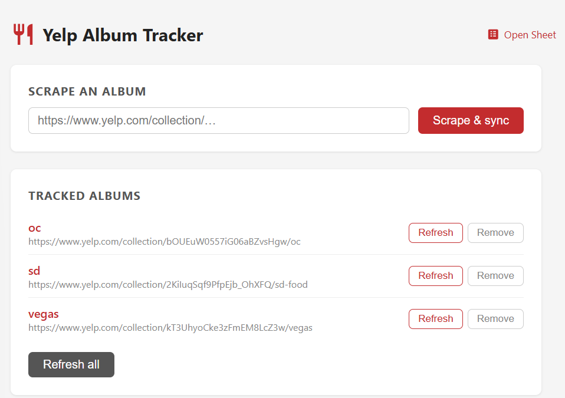
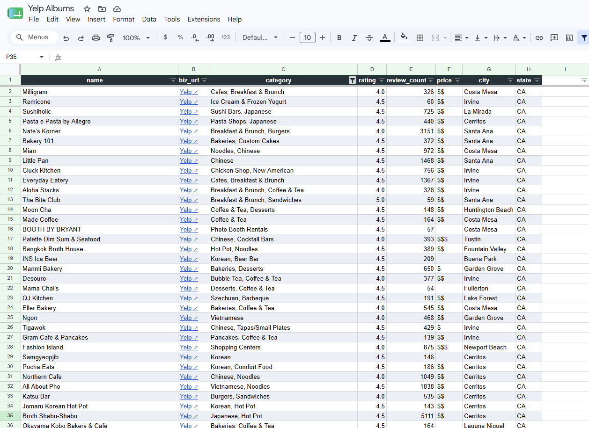
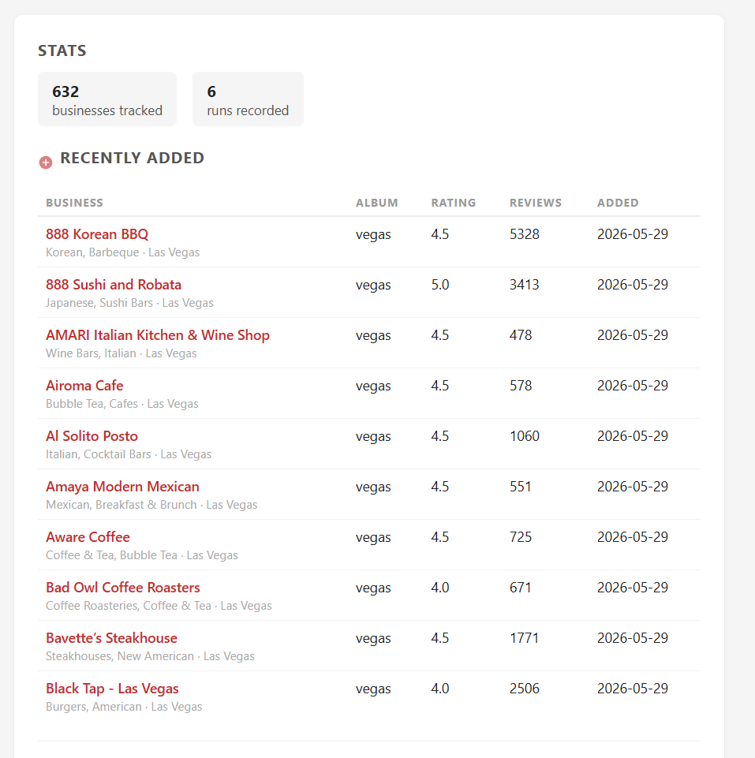
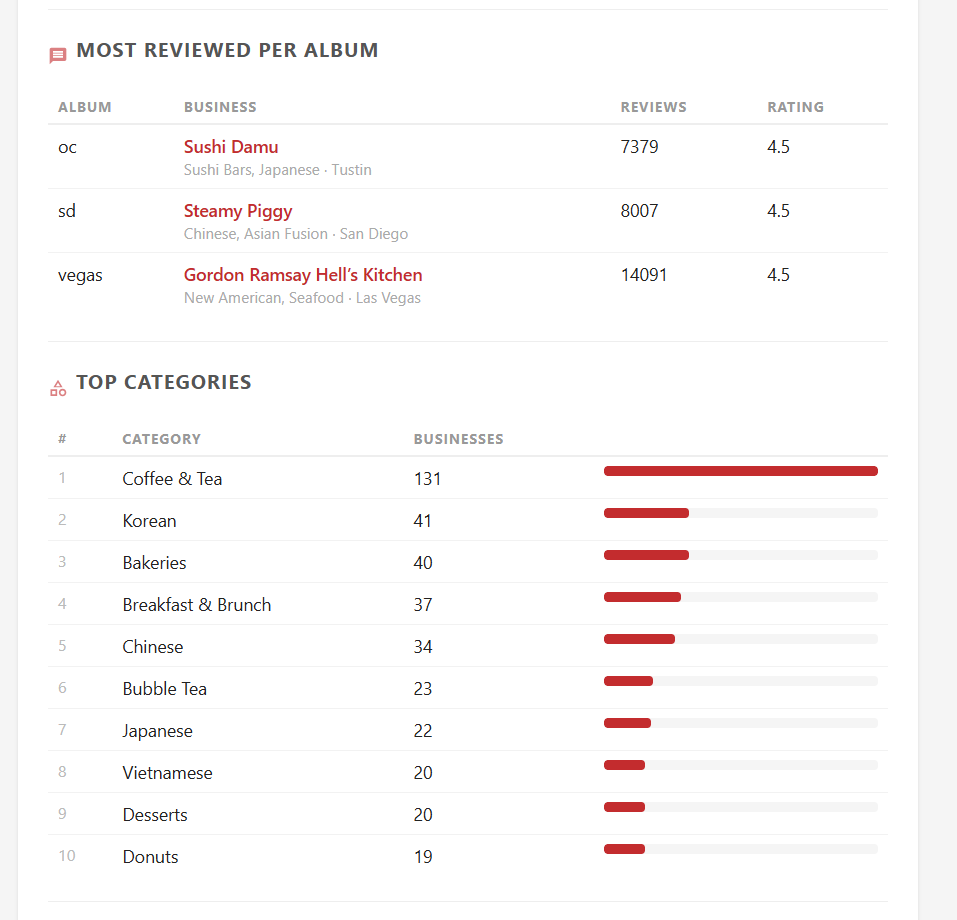

# Yelp Album Tracker

Track multiple Yelp collections in one place. Paste in a public album URL and the app scrapes every business' name, category, rating, review count, price, and location, writing it all to a Google Sheet and a local SQLite database. A built-in scheduler re-scrapes your albums daily, recording a snapshot on each run so you can track changes over time. A stats dashboard on the home page surfaces newly added businesses, the most-reviewed spot per album, top categories, price tier breakdowns, and cities with the most reviews. Future features may include time-series analysis of upward-trending businesses and expanded statistics!

 

## Things to know

- The Google Sheet will retain its information regardless of whether the application is open
- Column headers persist across uploads and deletions
- Duplicate businesses are automatically ignored
- Entire albums can be refreshed or removed directly within the web interface

## Google sheet columns
| Column | Description |
|---|---|
| **name** | Business name |
| **biz_url** | Yelp business link |
| **category** | Business category |
| **rating** | Average star rating (rounded to nearest 0.5) |
| **review_count** | Total number of reviews |
| **price** | Price range (e.g. $$) |
| **city** | City |
| **state** | State |

## How it works

```
POST /scrape  →  Playwright (scroll to load all)
              →  BeautifulSoup (extract fields)
              →  SQLite (upsert businesses + record snapshot)
              →  gspread (upsert to Google Sheet)

APScheduler   →  runs every tracked album daily at SCHEDULE_TIME
```

---

## Prerequisites

- [Miniforge / conda](https://github.com/conda-forge/miniforge) (or any conda distribution)
- A Google account with access to Google Sheets
- A Google Cloud project (free tier is fine)

---

## 1 — Google Cloud setup

### 1a. Enable the Google Sheets API

1. Go to [console.cloud.google.com](https://console.cloud.google.com) and create a project (or pick an existing one).
2. Click **APIs & Services → Library**.
3. Search for **Google Sheets API** and click **Enable**.

### 1b. Create a service account (free)

1. **APIs & Services → Credentials → Create Credentials → Service account**.
2. Give it any name (e.g. `yelp-tracker`), click **Done**.
3. Click the new service account → **Keys → Add Key → Create new key → JSON**.
4. Save the downloaded file to `credentials/service-account.json` inside this repo.
   ```
   yelp-tracker/
   └── credentials/
       └── service-account.json   ← here
   ```
   This path is in `.gitignore` and will never be committed.

### 1c. Create a Google Sheet and share it

1. Create a new Google Sheet (using your personal email or any other email besides the service account).
2. Copy the **Sheet ID** from its URL:
   ```
   https://docs.google.com/spreadsheets/d/SHEET_ID_IS_HERE/edit
   ```
3. Open the service-account JSON and copy the `client_email` value (looks like `name@project.iam.gserviceaccount.com`).
4. In the Google Sheet, click **Share** and add that email as an **Editor**.

---

## 2 — Create a conda environment

```bash
conda create -n yelp_tracker python=3.11
conda activate yelp_tracker
pip install -r requirements.txt
playwright install chromium
```

The `playwright install chromium` step downloads the Chromium binary (~110 MB) and only needs to run once per machine.

---

## 3 — Configure .env

Copy the example file and fill in your values:

```bash
cp .env.example .env
```

```ini
# Path to the service account JSON (relative to project root)
GOOGLE_CREDENTIALS_PATH=credentials/service-account.json

# The ID from your Google Sheet URL
GOOGLE_SHEET_ID=your_sheet_id_here

# Tab name inside the sheet
GOOGLE_WORKSHEET_NAME=Sheet1

# Daily run time (24-hour, local time)
SCHEDULE_TIME=03:00
```

---

## 4 — Run locally with the following commands 

```bash
conda activate yelp_tracker (name of your conda env)
uvicorn app.main:app --reload
```

Open [http://localhost:8000](http://localhost:8000) in your browser.

Paste a Yelp album URL into the form and click **Scrape & sync**. A Chromium window will open, scroll through the album, then close. Results land in your Google Sheet within a minute or two depending on how many businesses the album has.


---


## Project layout

```
  yelp-album-tracker/
  ├── app/
  │   ├── __init__.py
  │   ├── config.py          # loads .env
  │   ├── database.py        # SQLite schema, connection factory, JSON migration
  │   ├── main.py            # FastAPI routes + lifespan
  │   ├── parser.py          # HTML → list of dicts
  │   ├── pipeline.py        # scraper → parser → SQLite → sheets
  │   ├── scheduler.py       # APScheduler daily job
  │   ├── scraper.py         # Playwright: URL → HTML
  │   ├── sheets.py          # dicts → Google Sheet (upsert)
  │   ├── storage.py         # album + business CRUD, snapshot writes, stats queries
  │   └── templates/
  │       └── index.html     # main UI + inline stats dashboard
  ├── credentials/           # gitignored
  │   └── service-account.json
  ├── tests/
  │   ├── fixtures/
  │   │   └── sample_album.html
  │   ├── conftest.py        # redirects DB to tmp path for all tests
  │   ├── test_main.py
  │   ├── test_parser.py
  │   ├── test_pipeline.py
  │   ├── test_scheduler.py
  │   ├── test_scraper.py
  │   ├── test_sheets.py
  │   └── test_storage.py
  ├── data/                  # gitignored, created on first run
  │   ├── albums.json        # legacy — auto-migrated to SQLite on first startup
  │   └── yelp_albums.db     # SQLite database (albums, businesses, snapshots)
  ├── .env                   # gitignored
  ├── .env.example
  ├── requirements.txt
  └── README.md
```

## Scheduler
The app includes a built-in scheduler that automatically refreshes all tracked albums at a set time each day. The default run time is 3:00 AM and can be changed by updating `SCHEDULE_TIME` in your `.env` file:

```env
SCHEDULE_TIME=08:30
```

Note that the scheduler only fires if the server is actively running at the scheduled time — it is not a background system process. If the server is closed, the job will be skipped until the next scheduled run.
---

## Stats dashboard
The app hosts a dashboard of your tracked albums, including:

- 10 most recently added businesses
- Most-reviewed business per album
- Top categories across all albums
- Price tier breakdown by album

 

  
## Yelp scraping notes

- Albums use infinite scroll. To ensure full search of each album, the scraper scrolls until the business count stops growing for 3 consecutive passes.
- The browser launches **non-headless** by default to reduce bot-detection risk. Expect occasional CAPTCHAs on large or frequently-scraped albums.
- If Yelp starts blocking: try adding a longer `scroll_pause` in `scraper.py`, or look into [playwright-stealth](https://github.com/AtuboDad/playwright_stealth) and residential proxies as escalation options.
